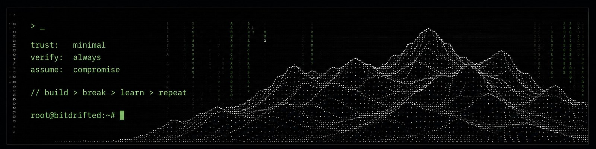

  

# bitdrifted

> Building autonomous systems, breaking assumptions, and trusting as little infrastructure as possible.

Working around the edges of **automation, cryptography, Bitcoin, distributed systems, infrastructure, and security-minded tooling**.

Most systems work beautifully right up until the moment you depend on them.

So I build things.

### Operating principles

* Don't trust; Verify
* Automate what shouldn't require a human twice
* Understand the abstraction beneath the abstraction
* Keep secrets out of repositories
* Assume the failure mode exists
* Build the tool you wish existed

### Currently building

Experiments in automation, resilient systems, infrastructure tooling, cryptographic concepts, and small utilities that solve disproportionately annoying problems.

Some of it will be useful.

Some of it will be evidence.

---

**signal > noise**

<!--
**bitdrifted/bitdrifted** is a ✨ _special_ ✨ repository because its `README.md` (this file) appears on your GitHub profile.

Here are some ideas to get you started:

- 🔭 I’m currently working on ...
- 🌱 I’m currently learning ...
- 👯 I’m looking to collaborate on ...
- 🤔 I’m looking for help with ...
- 💬 Ask me about ...
- 📫 How to reach me: ...
- 😄 Pronouns: ...
- ⚡ Fun fact: ...
-->
